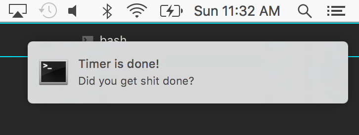

# Get Shit Done Timer

A simple command line timer for helping you get shit done 




#### Install
```
npm install -g gsd
```

#### Usage

```
gsd -b -n -c blue 15
```

Starts a 15 minute timer with a break afterwards, a notification when your time is up, and the progress bar color of blue. 


#### Options 

```
  Usage: gsd [options] <minutes>

  Options:

    -h, --help           output usage information
    -b, --break          Want a 5 minute break after timer is done? (add flag if you want a break)
    -n, --notification   Show notification (add flag if you want a notification)
    -c, --color <color>  Color of progress bar - red, yellow, green, blue, cyan, magenta or black
    
```

##### License

MIT
